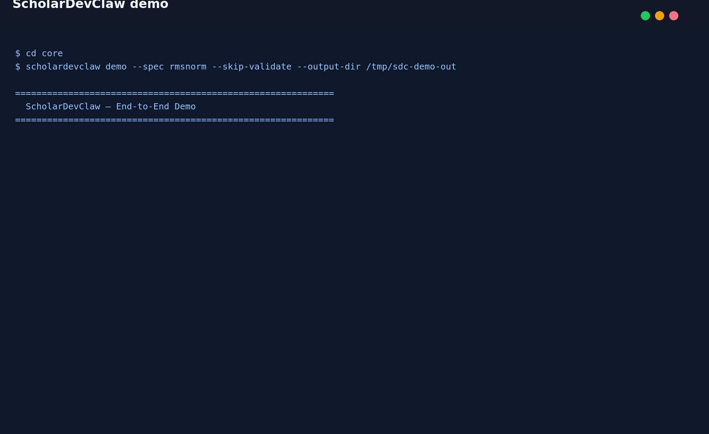

# ScholarDevClaw

ScholarDevClaw reads any arXiv paper and patches your codebase. Automatically.



```bash
pip install scholardevclaw
scholardevclaw demo
scholardevclaw integrate /path/to/repo rmsnorm
```

ScholarDevClaw analyzes an existing repository, finds research-backed improvements, maps them onto concrete files, generates patch artifacts, and validates the expected impact. It ships as a Python CLI, an optional Textual TUI, a FastAPI service, and a TypeScript orchestrator. The same shared pipeline powers every interface.

## Architecture

```text
┌─────────────────────────────────────────────────────────────┐
│                    ScholarDevClaw                          │
├─────────────────────────────────────────────────────────────┤
│  Unified Pipeline                                           │
│  • Repo intelligence                                        │
│  • Research intelligence                                    │
│  • Mapping                                                  │
│  • Patch generation                                         │
│  • Validation                                               │
│  • Reporting                                                │
└─────────────────────────────────────────────────────────────┘
                           │
              ┌────────────┴────────────┐
              ▼                         ▼
    ┌───────────────────┐     ┌────────────────────┐
    │ Python Core       │     │ TypeScript Agent   │
    │ CLI / TUI /       │     │ Orchestrator +     │
    │ FastAPI           │     │ bridge adapters    │
    └───────────────────┘     └────────────────────┘
```

## Supported Languages

| Language | Status | Frameworks |
|----------|--------|------------|
| Python | Full | PyTorch, TensorFlow, Django, Flask, FastAPI |
| JavaScript | Full | Express, React, Vue, Angular |
| TypeScript | Full | Next.js, NestJS |
| Go | Basic | Gin, Echo |
| Rust | Basic | Actix, Rocket |
| Java | Basic | Spring, Maven |
| C/C++ | Planned | - |
| Ruby | Planned | Rails |

## Run It

Use the CLI directly:

```bash
scholardevclaw --help
scholardevclaw specs --list
scholardevclaw demo
scholardevclaw tui
```

Run the API locally:

```bash
uvicorn scholardevclaw.api.server:app --reload
```

Run the TypeScript orchestrator:

```bash
cd agent
bun install
bun run dev
```

## What The Demo Shows

The committed [`demo.tape`](demo.tape) and `demo.gif` walk through a real `scholardevclaw demo` run against nanoGPT. The flow analyzes the repository, surfaces relevant papers, maps a selected paper to code locations, writes patch artifacts, and prints a validation-ready summary. The same command is the fastest smoke test for a fresh install.

## Project Surfaces

| Surface | Entry point | Purpose |
|---------|-------------|---------|
| CLI | `core/src/scholardevclaw/cli.py` | Direct repo analysis and end-to-end workflows |
| TUI | `scholardevclaw tui` | Interactive keyboard-first workflow runner |
| API | `core/src/scholardevclaw/api/server.py` | Programmatic access for integrations |
| Agent | `agent/src/index.ts` | Control-plane orchestration and resumable phases |

## Docs

- [Quick Start Guide](demo.md)
- [API Reference](docs/API.md)
- [Deployment Guide](docs/DEPLOYMENT.md)
- [Architecture Notes](ARCHITECTURE.md)
- [Agent Handbook](AGENTS.md)

## Contributing And Community

Start with [CONTRIBUTING.md](CONTRIBUTING.md). Use [GitHub Discussions](https://github.com/Ronak-IIITD/ScholarDevClaw/discussions) for questions and show-and-tell, and [GitHub Issues](https://github.com/Ronak-IIITD/ScholarDevClaw/issues) for bugs or feature requests.
